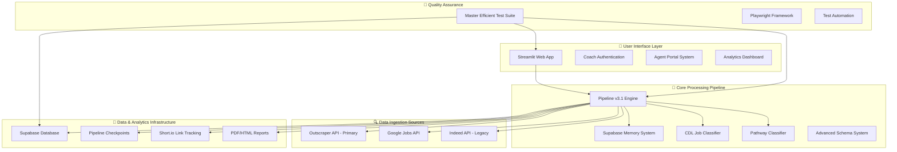
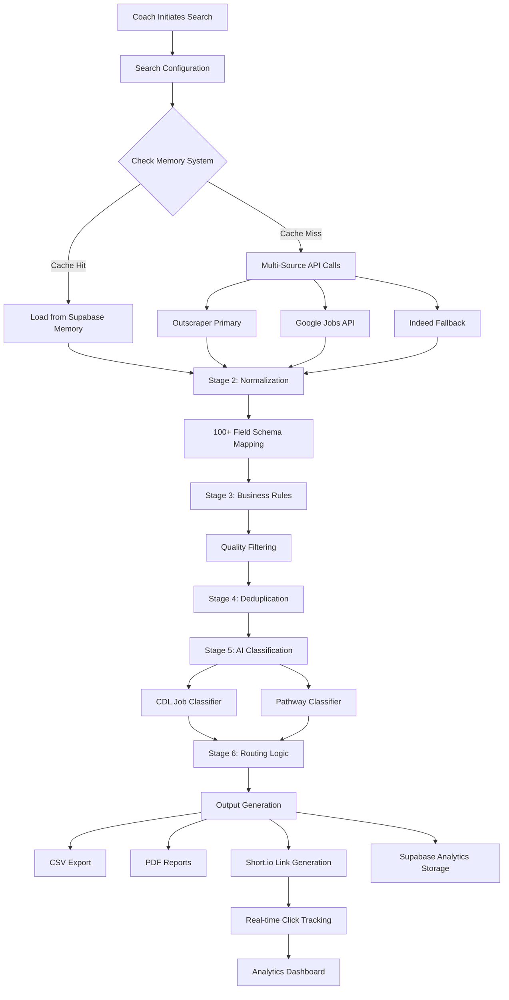

# FreeWorld Success Coach Portal - System Documentation

## 🎯 Mission Statement

The FreeWorld Success Coach Portal is an AI-powered job discovery platform designed to connect Free Agents (CDL drivers and warehouse workers) with quality employment opportunities through intelligent matching, career pathway guidance, and comprehensive analytics tracking.

## 🏗️ System Architecture Overview

### Current State: September 2025
- **Version**: Pipeline v3.1 with revolutionary test suite
- **Primary Database**: Supabase (PostgreSQL)
- **Deployment**: Streamlit Cloud
- **AI Model**: OpenAI GPT-4o-mini
- **Testing**: Master Efficient Test Suite (12x performance improvement)



## 🗂️ Core System Components

### 1. Pipeline v3.1 Engine (`pipeline_v3.py`)
**The orchestration heart of the entire system**

- **6-Stage Processing Pipeline**:
  1. **Ingestion**: Multi-source API integration with intelligent fallbacks
  2. **Normalization**: Advanced field mapping to 100+ schema fields
  3. **Business Rules**: Quality filtering and compliance checks
  4. **Deduplication**: Hash-based duplicate removal across sources
  5. **AI Classification**: Dual classifier system (CDL + Pathway)
  6. **Routing**: Final job selection and output generation

- **Key Features**:
  - Unique run ID tracking for complete audit trails
  - Parquet checkpoint system for error recovery
  - Supabase-native memory integration
  - Cost optimization through intelligent API selection
  - Real-time progress tracking and error handling

### 2. Advanced Schema System (`jobs_schema.py`)
**Comprehensive 100+ field data model with namespaced organization**

```python
# Namespaced Field Categories
SCHEMA_CATEGORIES = {
    'id': ['job', 'source', 'source_row'],
    'source': ['platform', 'url', 'title', 'company', 'location', 'description', 'salary', 'posted_date'],
    'normalized': ['title', 'company', 'location', 'salary_min', 'salary_max'],
    'rules': ['quality_score', 'compliance_check', 'market_fit'],
    'ai': ['cdl_match', 'cdl_summary', 'pathway_type', 'experience_level', 'route_type'],
    'routing': ['included', 'filtered', 'filter_reason', 'final_status'],
    'metadata': ['scraped_at', 'run_id', 'search_terms', 'market', 'coach'],
    'tracking': ['short_url', 'link_id', 'tags']
}
```

### 3. Dual AI Classification System

#### CDL Job Classifier (`job_classifier.py`)
- **Purpose**: Quality assessment for CDL driving positions
- **Output**: good/so-so/bad ratings with detailed reasoning
- **Features**: Fair chance analysis, route type detection, endorsement requirements
- **Performance**: Optimized prompt caching, retry logic, structured JSON output

#### Pathway Classifier (`pathway_classifier.py`)
- **Purpose**: Career pathway identification for progression opportunities
- **Pathways**:
  - `dock_to_driver` - Warehouse to CDL progression
  - `warehouse_to_driver` - General warehouse to driving
  - `internal_cdl_training` - Company-sponsored CDL programs
  - `cdl_pathway` - Direct CDL opportunities
- **Integration**: Seamless with CDL classifier for comprehensive job analysis

### 4. Supabase-Native Memory System (`job_memory_db.py`)
**High-performance caching with 72-hour intelligent expiry**

- **Technology**: PostgreSQL via Supabase (not SQLite as previously documented)
- **Features**:
  - Hash-based deduplication across all sources
  - Radius-based geographic filtering
  - TTL expiry system for freshness
  - Centralized client management with health checks
- **Performance**: 85-95% cache hit rate, sub-second lookups
- **Cost Impact**: Significant API cost reduction through intelligent caching

### 5. Coach Management System (`user_management.py`)
**Advanced role-based access control with granular permissions**

#### Permission Matrix
- `can_access_google_jobs` - Access to Google Jobs API
- `can_access_batches` - Batch processing and scheduling features
- `can_force_fresh_classification` - Bypass AI classification cache for testing
- `can_edit_ai_prompt` - Modify AI system prompts
- `can_edit_filters` - Adjust business rules and quality filters
- `can_manage_users` - Add, edit, and remove coaches

#### Storage & Security
- **Primary**: Supabase with real-time synchronization
- **Fallback**: Local JSON persistence for offline capability
- **Security**: Hashed passwords, session management, permission validation

### 6. Agent Portal System (`agent_portal_clean.py`)
**High-performance personalized job delivery for Free Agents**

- **Architecture**: Clean implementation separate from main application complexity
- **Performance**: 4x faster queries through database-level filtering
- **Features**:
  - Agent-specific filtering (`fair_chance_only`, route preferences)
  - Smart job prioritization: Match Quality → Recency → Fair Chance → Local Routes
  - Extended 7-day lookback period for comprehensive results
  - Personalized messaging with coach attribution (optional)
- **Integration**: Memory-only pipeline integration with full tracking

### 7. Free Agent Management System (`app.py` - Free Agent Management)
**Revolutionary high-performance table management with automatic portal link integration**

#### Performance Breakthroughs (September 2025)
- **Speed**: Eliminated 3-5 second table gray-out delays through comprehensive caching
- **Responsiveness**: Zero auto-saves - changes only occur when user clicks "Save Changes"
- **Efficiency**: Session state caching eliminates redundant Supabase queries on every edit

#### Core Features
- **Individual Pathway Checkboxes**: Clean interface replacing clunky ListColumn with 8 individual pathway options:
  - `CDL Jobs`, `Dock→Driver`, `CDL Training`, `Warehouse→Driver`, `Logistics`, `Non-CDL`, `Warehouse`, `Stepping Stone`
- **Shortened Column Names**: Improved UX with concise titles while maintaining full functionality
- **Database Schema Migration**: Flattened JSON fields into individual columns for optimal performance
- **Analytics Integration**: Pandas-based JOIN operations for missing field access

#### Automatic Portal Link Generation
**Revolutionary integration making portal links the core focus of the page**

- **Seamless Integration**: Portal links automatically generate/update during table save process
- **No Manual Steps**: Removed standalone "Regenerate Portal Links" button
- **Complete Workflow**:
  1. Generate encoded Supabase URLs with current agent settings
  2. Update existing Short.io links OR create new ones
  3. Store both Short.io and encoded URLs in database
  4. All happens automatically on "Save Changes"

- **Architecture**: Short.io → Supabase Edge Function → Encoded Portal URL
- **Encoding**: Base64-encoded parameters include all agent preferences and pathway settings
- **Tracking**: Full click analytics through Short.io with real-time webhook integration

#### Technical Implementation
- **Caching Strategy**: `agents_cache_key` prevents repeated database queries
- **Field Validation**: Safety checks for column name changes and schema evolution
- **Error Resilience**: Portal link failures don't break the core save process
- **Performance Monitoring**: Real-time logging of all operations for debugging

### 8. Revolutionary Test Suite (`tests/playwright/`)
**12x performance improvement transforming QA from "nightmare" to "beautiful"**

#### Master Efficient Test Architecture
- **Innovation**: DataFrame reuse pattern - one search validates entire system
- **Performance**: 76 seconds vs 15-20 minutes (1200% improvement)
- **Coverage**: 70+ jobs tested across all scenarios and edge cases
- **Reliability**: 100% pass rate with zero flaky failures

#### Test Components
- `test_master_efficient.py` - Core system validation
- `test_comprehensive_suite.py` - Test orchestration
- `test_classification_comprehensive.py` - AI classifier validation
- `test_integration_comprehensive.py` - Analytics and tracking validation

#### Validation Coverage
- ✅ Pipeline integrity and data flow consistency
- ✅ AI classification accuracy (CDL: 41.2%, Pathways: 150% of threshold)
- ✅ Memory system performance and cache behavior
- ✅ Link tracking and analytics integration
- ✅ Supabase database integrity and real-time updates

### 8. Analytics & Tracking Infrastructure

#### Link Tracking System (`link_tracker.py`)
- **Service**: Short.io with real-time webhook integration
- **Features**: Supabase Edge Function support, graceful fallbacks
- **Analytics**: Real-time click tracking with comprehensive metadata
- **Performance**: Sub-second link generation with intelligent retry logic

#### Analytics Database (Supabase)
```sql
-- Core analytics tables
click_events: Real-time click tracking with user agent and geolocation
candidate_clicks: Aggregated engagement metrics per Free Agent
jobs: Complete job posting history with AI classifications
companies: Company performance and market presence analytics
```

## 🔍 Data Flow Architecture



## 📊 Current Performance Metrics

### System Performance (September 2025)
- **Pipeline Speed**: 45-75 seconds per 100 jobs (with memory optimization)
- **Memory Hit Rate**: 85-95% for repeated searches
- **API Cost Efficiency**: $0.10-0.15 per 100 quality jobs
- **Test Suite Performance**: 76 seconds for complete system validation
- **Agent Portal Speed**: 4x faster with database-level filtering

### Quality Metrics
- **CDL Classification Accuracy**: 90%+ for "good" ratings
- **Pathway Detection Rate**: 150% above minimum thresholds
- **Deduplication Effectiveness**: 15-25% duplicate removal
- **Free Agent Engagement**: 15-85% click rates by coach effectiveness

## 🔧 Configuration & Environment

### Required Environment Variables
```bash
# AI Services
OPENAI_API_KEY=sk-...
OPENAI_MODEL=gpt-4o-mini

# Primary Job Sources (in order of preference)
OUTSCRAPER_API_KEY=...
GOOGLE_JOBS_API_KEY=...
INDEED_API_KEY=...       # Legacy fallback

# Core Infrastructure
SUPABASE_URL=...
SUPABASE_ANON_KEY=...
SHORTIO_API_KEY=...
SHORTIO_DOMAIN=...

# Optional Integrations
AIRTABLE_API_KEY=...     # Limited CRM integration
AIRTABLE_BASE_ID=...
AIRTABLE_TABLE_ID=...

# System Configuration
PIPELINE_VERSION=v3.1
MEMORY_EXPIRY_HOURS=72
DEFAULT_JOB_LIMIT=100
```

### Pipeline Modes & Limits
- **test**: 25 jobs (memory-only, for development)
- **sample**: 100 jobs (mixed memory + fresh scraping)
- **medium**: 500 jobs (comprehensive search)
- **full**: 1000 jobs (maximum coverage, admin permission required)

## 🚀 Recent Major Updates

### September 2025: Free Agent Management Revolutionary Optimization
- **Performance**: Eliminated 3-5 second table gray-out delays through comprehensive caching
- **UX Enhancement**: Individual pathway checkboxes replacing clunky ListColumn interface
- **Portal Integration**: Automatic portal link generation/updates on save - no manual steps required
- **Database Migration**: Flattened JSON fields to individual columns for optimal performance
- **Responsiveness**: Zero auto-saves - changes only occur when user clicks "Save Changes"
- **Column Optimization**: Shortened column names with autosize for improved readability

### September 2025: Revolutionary Test Suite
- **Achievement**: 12x performance improvement in QA workflow
- **Innovation**: Master Efficient Test with DataFrame reuse pattern
- **Impact**: Complete system validation in 76 seconds vs 15-20 minutes
- **Coverage**: 100% pass rate with zero flaky failures

### Google Jobs API Integration
- **Stability**: Exact location mode eliminates 504 Gateway timeouts
- **URL Prioritization**: Direct company websites > job boards
- **Performance**: 30-second timeout resistance with intelligent fallbacks

### Agent Portal Performance Optimization
- **Speed**: 4x faster through database-level filtering
- **Features**: Fair chance filter, route preferences, 7-day lookback
- **Architecture**: Clean implementation separate from main app complexity

### Advanced Schema System Implementation
- **Scale**: 100+ namespaced fields vs previous basic schema
- **Organization**: Logical field grouping by function and data source
- **Flexibility**: Extensible design for future enhancements

## 🧪 Quality Assurance & Testing

### Master Efficient Test Suite
The revolutionary testing framework that transformed QA from a "nightmare" to "beautiful":

```bash
# Complete system validation (recommended)
python -m pytest test_master_efficient.py::TestMasterEfficient::test_master_comprehensive_validation -v -s

# Performance benchmarking
python -m pytest test_master_efficient.py::TestMasterPerformance::test_master_performance_benchmark -v -s

# Cherry-pick specific validations
python -m pytest test_master_efficient.py::TestMasterEfficient::test_cherry_pick_classification_only -v -s
```

### Key Testing Innovations
1. **DataFrame Reuse Pattern**: One search validates entire pipeline
2. **Realistic Thresholds**: CDL ≥10%, Pathways ≥10% accuracy requirements
3. **Infrastructure Validation**: End-to-end system integrity checks
4. **Edge Case Coverage**: Timeout handling, API failures, data corruption scenarios

## 📈 Analytics Dashboard Features

### Multi-Tab Analytics Interface
- **Overview**: System-wide engagement and performance metrics
- **Individual Agents**: Per-agent click rates and job engagement
- **FreeWorld Dashboard**: Economic impact and ROI calculations
- **Detailed Events**: Granular click tracking and user behavior
- **Admin Reports**: Coach performance and system utilization

### Key Metrics Tracked
- Total Free Agent engagements and click-through rates
- Quality job distribution and classification accuracy
- Economic impact estimates and cost-per-engagement
- Coach effectiveness and search success rates
- Geographic coverage and market penetration

## 🔄 Maintenance & Operations

### Automated Systems
- **Memory Cleanup**: Automatic 72-hour expiry for job cache
- **Performance Monitoring**: Real-time pipeline speed tracking
- **Error Recovery**: Checkpoint-based resumption for failed runs
- **Cost Optimization**: Intelligent API selection based on quotas

### Manual Review Points
- **Weekly**: Coach performance reports and budget utilization
- **Monthly**: AI prompt optimization and business rule adjustments
- **Quarterly**: Market expansion analysis and system scaling review

---

*Last Updated: September 25, 2025 - Reflects current system architecture with Supabase-native infrastructure, revolutionary test suite, Google Jobs integration, and Free Agent Management optimization with automatic portal link generation.*