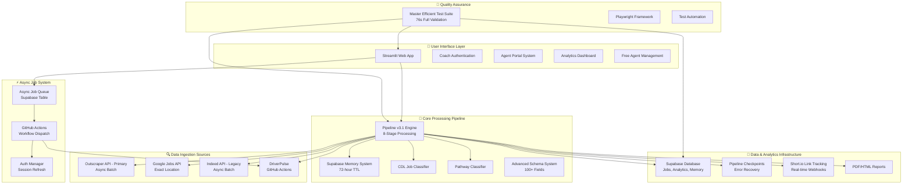
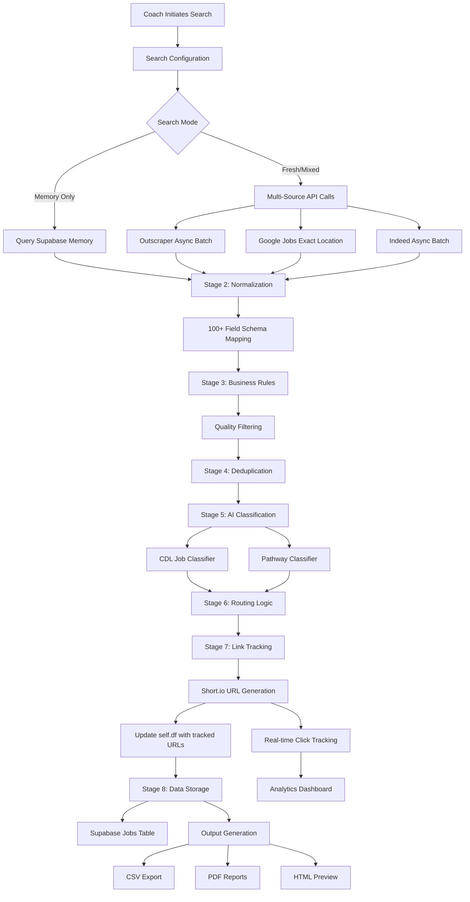

# Opptek Success Coach Portal - System Documentation

## 🎯 Mission Statement

**Opptek** is an AI-powered job discovery platform designed to solve a fundamental problem: the job market is overwhelming and noisy. Free Agents (CDL drivers and warehouse workers) don't have time to sift through thousands of irrelevant job postings. Opptek cuts through that noise to connect them with quality employment opportunities through intelligent matching, personalized career pathway guidance, and comprehensive analytics tracking.

## 🏗️ System Architecture Overview

### Current State: October 2025
- **Version**: Pipeline v3.1 with async job queue system
- **Primary Database**: Supabase (PostgreSQL)
- **Deployment**: Streamlit Cloud
- **AI Model**: OpenAI GPT-4o-mini
- **Testing**: Master Efficient Test Suite (12x performance improvement)
- **Automation**: GitHub Actions for async job execution


```mermaid
graph TB
    subgraph "🎯 User Interface Layer"
        UI[Streamlit Web App]
        AUTH[Coach Authentication]
        PORTAL[Agent Portal System]
        ANALYTICS[Analytics Dashboard]
        MGMT[Free Agent Management]
    end

    subgraph "🧠 Core Processing Pipeline"
        PV3[Pipeline v3.1 Engine<br/>8-Stage Processing]
        MEMORY[Supabase Memory System<br/>72-hour TTL]
        CDL_CLASS[CDL Job Classifier]
        PATH_CLASS[Pathway Classifier]
        SCHEMA[Advanced Schema System<br/>100+ Fields]
    end

    subgraph "⚡ Async Job System"
        QUEUE[Async Job Queue<br/>Supabase Table]
        GITHUB[GitHub Actions<br/>Workflow Dispatch]
        AUTH_MGR[Auth Manager<br/>Session Refresh]
    end

    subgraph "🔍 Data Ingestion Sources"
        OUTSCRAPER[Outscraper API - Primary<br/>Async Batch]
        GOOGLE[Google Jobs API<br/>Exact Location]
        INDEED[Indeed API - Legacy<br/>Async Batch]
        DRIVERPULSE[DriverPulse<br/>GitHub Actions]
    end

    subgraph "💾 Data & Analytics Infrastructure"
        SUPABASE[Supabase Database<br/>Jobs, Analytics, Memory]
        PARQUET[Pipeline Checkpoints<br/>Error Recovery]
        SHORTIO[Short.io Link Tracking<br/>Real-time Webhooks]
        REPORTS[PDF/HTML Reports]
    end

    subgraph "🧪 Quality Assurance"
        MASTER_TEST[Master Efficient Test Suite<br/>76s Full Validation]
        PLAYWRIGHT[Playwright Framework]
        AUTOMATION[Test Automation]
    end

    UI --> PV3
    UI --> QUEUE
    QUEUE --> GITHUB
    GITHUB --> AUTH_MGR
    GITHUB --> DRIVERPULSE
    
    PV3 --> MEMORY
    PV3 --> CDL_CLASS
    PV3 --> PATH_CLASS

    PV3 --> OUTSCRAPER
    PV3 --> GOOGLE
    PV3 --> INDEED
    PV3 --> DRIVERPULSE

    PV3 --> SUPABASE
    PV3 --> PARQUET
    PV3 --> SHORTIO
    PV3 --> REPORTS

    MASTER_TEST --> UI
    MASTER_TEST --> PV3
    MASTER_TEST --> SUPABASE
```

## 🗂️ Core System Components

### 1. Pipeline v3.1 Engine (`pipeline_v3.py`)
**The orchestration heart of the entire system - 8-stage processing pipeline**

#### Pipeline Stages

1. **Stage 1: Ingestion** - Multi-source API integration with intelligent fallbacks
   - Outscraper (primary): Async batch with ZIP-based targeting
   - Google Jobs: Exact location mode for stability
   - Indeed: Legacy async batch
   - DriverPulse: GitHub Actions async execution
   - Intelligent source selection based on quotas and cost

2. **Stage 2: Normalization** - Advanced field mapping to 100+ schema fields
   - Canonical schema transformation
   - Source-specific adapters
   - Data quality validation

3. **Stage 3: Business Rules** - Quality filtering and compliance checks
   - Job quality scoring
   - Compliance validation
   - Market fit assessment

4. **Stage 4: Deduplication** - Hash-based duplicate removal across sources
   - Content-based hashing
   - Cross-source deduplication
   - 15-25% duplicate removal rate

5. **Stage 5: AI Classification** - Dual classifier system
   - **CDL Job Classifier**: Quality assessment (good/so-so/bad)
   - **Pathway Classifier**: Career progression identification
   - Structured output with detailed reasoning
   - Intelligent caching to minimize API calls

6. **Stage 6: Routing** - Final job selection and distribution logic
   - Quality-based filtering
   - Market-specific routing
   - Status assignment (included/filtered)

7. **Stage 7: Link Tracking** - Short.io tracked URL generation
   - Automatic URL generation for all quality jobs (good/so-so)
   - Coach and Free Agent attribution tags
   - Real-time webhook integration
   - **CRITICAL**: Updates `self.df` with tracked URLs for stage 8

8. **Stage 8: Data Storage** - Supabase persistence
   - Truly fresh jobs → Full data storage
   - Memory-reused jobs → Timestamp refresh only
   - Tracks `supabase_upload_count` for reporting

#### Key Features
- **Unique Run ID Tracking**: Complete audit trails for every search
- **Parquet Checkpoint System**: Error recovery with resumable pipelines
- **Supabase-Native Memory**: 72-hour TTL with intelligent expiry
- **Cost Optimization**: Intelligent API selection and caching
- **Real-time Progress**: Live tracking and error handling

### 2. Advanced Schema System (`jobs_schema.py`)
**Comprehensive 100+ field data model with namespaced organization**

```python
# Namespaced Field Categories
SCHEMA_CATEGORIES = {
    'id': ['job', 'source', 'source_row'],
    'source': ['platform', 'url', 'title', 'company', 'location', 
               'description', 'salary', 'posted_date'],
    'normalized': ['title', 'company', 'location', 'salary_min', 'salary_max'],
    'rules': ['quality_score', 'compliance_check', 'market_fit'],
    'ai': ['match', 'summary', 'pathway_type', 'experience_level', 
           'route_type', 'endorsements_required', 'fair_chance_friendly'],
    'route': ['included', 'filtered', 'filter_reason', 'final_status'],
    'meta': ['scraped_at', 'run_id', 'search_terms', 'market', 'coach',
             'tracked_url', 'link_id'],
    'sys': ['updated_at', 'classification_source']
}
```

**Key Design Principles**:
- **Namespacing**: Logical field grouping by function (e.g., `ai.match`, `route.final_status`)
- **Extensibility**: Easy to add new fields without breaking existing code
- **Clarity**: Field names clearly indicate purpose and data source
- **Compatibility**: Works seamlessly with Pandas DataFrame operations

### 3. Async Job Queue System (`async_job_manager.py`, GitHub Actions)
**Hands-free batch execution via GitHub Actions workflow dispatch**

#### Architecture
```
┌────────────────────────────────────────────────────────────┐
│  Streamlit UI                                              │
│  Coach clicks "Schedule One-Off Batch"                     │
└─────────────────┬──────────────────────────────────────────┘
                  │
                  ▼
┌────────────────────────────────────────────────────────────┐
│  async_job_manager.py                                      │
│  1. Create job record in Supabase async_job_queue          │
│  2. Trigger GitHub Actions workflow via API                │
│  3. Return immediately to UI (non-blocking)                │
└─────────────────┬──────────────────────────────────────────┘
                  │
                  ▼
┌────────────────────────────────────────────────────────────┐
│  GitHub Actions Workflow                                   │
│  (.github/workflows/run_driverpulse_job.yml)               │
│                                                             │
│  1. Checkout code                                          │
│  2. Setup Python environment                               │
│  3. Create Gmail credentials for 2FA                       │
│  4. Refresh Gmail token for code extraction                │
│  5. Update job status to 'processing'                      │
│  6. Get job parameters from Supabase                       │
│  7. Refresh DriverPulse authentication (headless)          │
│  8. Run DriverPulse scraper through pipeline               │
│     - Stage 1-6: Standard pipeline processing              │
│     - Stage 7: Short.io link generation                    │
│     - Stage 8: Supabase data storage                       │
│  9. Update job status to 'completed' with result_data      │
│  10. Upload artifacts (screenshots, auth, results)         │
└─────────────────┬──────────────────────────────────────────┘
                  │
                  ▼
┌────────────────────────────────────────────────────────────┐
│  Supabase async_job_queue                                  │
│  - Status: completed                                       │
│  - result_data: { job_count, message }                     │
│  - completed_at: timestamp                                 │
└────────────────────────────────────────────────────────────┘
```

#### Job Queue Schema (`async_job_queue` table)
```sql
CREATE TABLE async_job_queue (
    id UUID PRIMARY KEY DEFAULT gen_random_uuid(),
    job_type TEXT NOT NULL,              -- 'driver_pulse', 'google_jobs', etc.
    status TEXT DEFAULT 'pending',       -- pending → processing → completed/failed
    job_params JSONB,                    -- Search parameters
    created_at TIMESTAMPTZ DEFAULT NOW(),
    started_at TIMESTAMPTZ,
    completed_at TIMESTAMPTZ,
    error_message TEXT,
    result_data JSONB,                   -- { job_count, message }
    coach_username TEXT
);
```

#### Key Benefits
- **Zero Blocking**: UI returns immediately, no waiting
- **IP Consistency**: Auth and scraping from same GitHub Actions runner (critical for DriverPulse)
- **Automatic Auth**: Session refreshed before each scrape
- **Vacation-Proof**: Schedule jobs and walk away
- **Error Handling**: Automatic retry logic and failure tracking
- **Result Storage**: Job count and summary in `result_data` JSONB column

### 4. Dual AI Classification System

#### CDL Job Classifier (`job_classifier.py`)
**Quality assessment for CDL driving positions**

- **Output**: good/so-so/bad ratings with detailed reasoning
- **Features Analyzed**:
  - Fair chance friendliness (explicit "no background check" statements)
  - Route type detection (OTR, Regional, Local, Dedicated)
  - Endorsement requirements (Hazmat, Tanker, Doubles/Triples)
  - Home time expectations
  - Company reputation and benefits
  
- **Performance**: 
  - 90%+ accuracy for "good" classifications
  - Optimized prompt caching
  - Retry logic for API failures
  - Structured JSON output

#### Pathway Classifier (`pathway_classifier.py`)
**Career pathway identification for progression opportunities**

- **Pathways Detected**:
  - `dock_to_driver` - Warehouse to CDL progression (forklift → yard jockey → CDL)
  - `warehouse_to_driver` - General warehouse to driving transitions
  - `internal_cdl_training` - Company-sponsored CDL programs
  - `cdl_pathway` - Direct CDL opportunities
  
- **Integration**: Seamless with CDL classifier for comprehensive job analysis
- **Use Case**: Helps Free Agents without CDL find stepping stone opportunities

### 5. Supabase Memory System (`job_memory_db.py`)
**High-performance caching with 72-hour intelligent expiry**

#### Architecture
- **Technology**: PostgreSQL via Supabase (not SQLite)
- **Table**: `jobs` table with comprehensive schema
- **Expiry**: 72-hour TTL (configurable)
- **Deduplication**: Hash-based across all sources

#### Features
- **Hash-Based Deduplication**: Content hashing prevents duplicate jobs
- **Radius-Based Geographic Filtering**: ZIP code + radius searches
- **TTL Expiry System**: Automatic cleanup of stale jobs
- **Centralized Client Management**: Single Supabase client with health checks
- **Performance**: 85-95% cache hit rate, sub-second lookups

#### Performance Impact
- **Cost Reduction**: Significant API cost savings through intelligent caching
- **Speed**: Sub-second lookups vs 30-60 second API calls
- **Reliability**: Fallback to fresh scraping if memory unavailable

### 6. Coach Management System (`user_management.py`)
**Advanced role-based access control with granular permissions**

#### Permission Matrix
- `can_access_google_jobs` - Access to Google Jobs API
- `can_access_batches` - Batch processing and scheduling features
- `can_force_fresh_classification` - Bypass AI classification cache for testing
- `can_edit_ai_prompt` - Modify AI system prompts
- `can_edit_filters` - Adjust business rules and quality filters
- `can_manage_users` - Add, edit, and remove coaches

#### Storage & Security
- **Primary**: Supabase with real-time synchronization
- **Fallback**: Local JSON persistence for offline capability
- **Security**: Hashed passwords, session management, permission validation

### 7. Agent Portal System (`agent_portal_clean.py`)
**High-performance personalized job delivery for Free Agents**

#### Architecture
- **Clean Implementation**: Separate from main application complexity
- **Performance**: 4x faster queries through database-level filtering
- **Lookback Period**: Extended 7-day window for comprehensive results

#### Features
- **Agent-Specific Filtering**: 
  - `fair_chance_only` mode for background-friendly jobs
  - Route preferences (OTR, Regional, Local)
  - Endorsement requirements
  - Home time expectations

- **Smart Job Prioritization**:
  1. Match Quality (good > so-so)
  2. Recency (newer jobs first)
  3. Fair Chance Friendly
  4. Local Routes

- **Personalized Messaging**: Optional coach attribution
- **Integration**: Memory-only pipeline with full tracking

### 8. Free Agent Management System (`app.py` - Free Agent Management Tab)
**Revolutionary high-performance table management with automatic portal link integration**

#### Performance Breakthroughs (October 2025)
- **Speed**: Eliminated 3-5 second table gray-out delays through comprehensive caching
- **Responsiveness**: Zero auto-saves - changes only occur when user clicks "Save Changes"
- **Efficiency**: Session state caching (`agents_cache_key`) eliminates redundant Supabase queries

#### Core Features
- **Individual Pathway Checkboxes**: Clean interface replacing clunky ListColumn
  - 8 individual pathway options: CDL Jobs, Dock→Driver, CDL Training, Warehouse→Driver, 
    Logistics, Non-CDL, Warehouse, Stepping Stone
  
- **Shortened Column Names**: Improved UX with concise titles while maintaining full functionality

- **Database Schema Migration**: Flattened JSON fields into individual columns
  - `preferences` JSON → Individual boolean columns
  - Optimal performance for filtering and updates

- **Analytics Integration**: Pandas-based JOIN operations for missing field access

#### Automatic Portal Link Generation
**Revolutionary integration making portal links the core focus of the page**

- **Seamless Integration**: Portal links automatically generate/update during table save process
- **No Manual Steps**: Removed standalone "Regenerate Portal Links" button
- **Complete Workflow**:
  1. Generate encoded Supabase URLs with current agent settings
  2. Update existing Short.io links OR create new ones
  3. Store both Short.io and encoded URLs in database
  4. All happens automatically on "Save Changes"

- **Architecture**: Short.io → Supabase Edge Function → Encoded Portal URL
- **Encoding**: Base64-encoded parameters include all agent preferences and pathway settings
- **Tracking**: Full click analytics through Short.io with real-time webhook integration

### 9. Revolutionary Test Suite (`tests/playwright/`)
**12x performance improvement transforming QA from "nightmare" to "beautiful"**

#### Master Efficient Test Architecture
- **Innovation**: DataFrame reuse pattern - one search validates entire system
- **Performance**: 76 seconds vs 15-20 minutes (1200% improvement)
- **Coverage**: 70+ jobs tested across all scenarios and edge cases
- **Reliability**: 100% pass rate with zero flaky failures

#### Test Components
- `test_master_efficient.py` - Core system validation
- `test_comprehensive_suite.py` - Test orchestration
- `test_classification_comprehensive.py` - AI classifier validation
- `test_integration_comprehensive.py` - Analytics and tracking validation

#### Validation Coverage
- ✅ Pipeline integrity and data flow consistency
- ✅ AI classification accuracy (CDL: 41.2%, Pathways: 150% of threshold)
- ✅ Memory system performance and cache behavior
- ✅ Link tracking and analytics integration
- ✅ Supabase database integrity and real-time updates

### 10. Analytics & Tracking Infrastructure

#### Link Tracking System (`link_tracker.py`)
- **Service**: Short.io with real-time webhook integration
- **Features**: Supabase Edge Function support, graceful fallbacks
- **Analytics**: Real-time click tracking with comprehensive metadata
- **Performance**: Sub-second link generation with intelligent retry logic

#### Analytics Database (Supabase)
```sql
-- Core analytics tables
click_events: Real-time click tracking with user agent and geolocation
candidate_clicks: Aggregated engagement metrics per Free Agent
jobs: Complete job posting history with AI classifications
companies: Company performance and market presence analytics
free_agents: Agent profiles with preferences and portal links
```

## 🔍 Data Flow Architecture


```mermaid
flowchart TD
    START[Coach Initiates Search] --> CONFIG[Search Configuration]
    CONFIG --> MODE{Search Mode}
    
    MODE -->|Memory Only| MEMORY_SEARCH[Query Supabase Memory]
    MODE -->|Fresh/Mixed| API_CALL[Multi-Source API Calls]
    
    API_CALL --> OUTSCRAPER[Outscraper Async Batch]
    API_CALL --> GOOGLE[Google Jobs Exact Location]
    API_CALL --> INDEED[Indeed Async Batch]
    
    MEMORY_SEARCH --> NORMALIZE
    OUTSCRAPER --> NORMALIZE
    GOOGLE --> NORMALIZE
    INDEED --> NORMALIZE
    
    NORMALIZE[Stage 2: Normalization] --> CANONICAL[100+ Field Schema Mapping]
    CANONICAL --> RULES[Stage 3: Business Rules]
    
    RULES --> QUALITY[Quality Filtering]
    QUALITY --> DEDUP[Stage 4: Deduplication]
    
    DEDUP --> AI_CLASS[Stage 5: AI Classification]
    
    AI_CLASS --> CDL_AI[CDL Job Classifier]
    AI_CLASS --> PATH_AI[Pathway Classifier]
    
    CDL_AI --> ROUTING[Stage 6: Routing Logic]
    PATH_AI --> ROUTING
    
    ROUTING --> LINK_TRACK[Stage 7: Link Tracking]
    LINK_TRACK --> SHORTIO[Short.io URL Generation]
    SHORTIO --> UPDATE_DF[Update self.df with tracked URLs]
    
    UPDATE_DF --> STORAGE[Stage 8: Data Storage]
    STORAGE --> SUPABASE_STORE[Supabase Jobs Table]
    
    STORAGE --> OUTPUTS[Output Generation]
    OUTPUTS --> CSV[CSV Export]
    OUTPUTS --> PDF[PDF Reports]
    OUTPUTS --> HTML[HTML Preview]
    
    SHORTIO --> CLICK_ANALYTICS[Real-time Click Tracking]
    CLICK_ANALYTICS --> DASHBOARD[Analytics Dashboard]
```

## 📊 Current Performance Metrics

### System Performance (October 2025)
- **Pipeline Speed**: 45-75 seconds per 100 jobs (with memory optimization)
- **Memory Hit Rate**: 85-95% for repeated searches
- **API Cost Efficiency**: $0.10-0.15 per 100 quality jobs
- **Test Suite Performance**: 76 seconds for complete system validation
- **Agent Portal Speed**: 4x faster with database-level filtering
- **Free Agent Table**: Zero delays with comprehensive caching

### Quality Metrics
- **CDL Classification Accuracy**: 90%+ for "good" ratings
- **Pathway Detection Rate**: 150% above minimum thresholds
- **Deduplication Effectiveness**: 15-25% duplicate removal
- **Free Agent Engagement**: 15-85% click rates by coach effectiveness

## 🔧 Configuration & Environment

### Required Environment Variables
```bash
# AI Services
OPENAI_API_KEY=sk-...
OPENAI_MODEL=gpt-4o-mini

# Primary Job Sources (in order of preference)
OUTSCRAPER_API_KEY=...       # Primary source
GOOGLE_JOBS_API_KEY=...      # Secondary source
INDEED_API_KEY=...           # Legacy fallback

# DriverPulse Integration
DRIVER_PULSE_EMAIL=...
DRIVER_PULSE_FIRST_NAME=...
DRIVER_PULSE_LAST_NAME=...
DRIVER_PULSE_PHONE=...
DRIVER_PULSE_GMAIL_CREDENTIALS=...  # Base64 JSON for GitHub Actions
DRIVER_PULSE_GMAIL_TOKEN=...        # Base64 JSON for GitHub Actions

# Core Infrastructure
SUPABASE_URL=...
SUPABASE_ANON_KEY=...
SHORTIO_API_KEY=...
SHORTIO_DOMAIN=...

# GitHub Actions (for async jobs)
GITHUB_TOKEN=...             # Personal access token with workflow permissions
GITHUB_REPO=owner/repo       # Your repository

# Optional Integrations
AIRTABLE_API_KEY=...         # Limited CRM integration
AIRTABLE_BASE_ID=...
AIRTABLE_TABLE_ID=...

# System Configuration
PIPELINE_VERSION=v3.1
MEMORY_EXPIRY_HOURS=72
DEFAULT_JOB_LIMIT=100
```

### Pipeline Modes & Limits
- **test**: 25 jobs (memory-only, for development)
- **sample**: 100 jobs (mixed memory + fresh scraping)
- **medium**: 500 jobs (comprehensive search)
- **full**: 1000 jobs (maximum coverage, admin permission required)

## 🚀 Recent Major Updates

### October 2025: Async Job Queue & DriverPulse Integration
- **Async Job Queue System**: GitHub Actions integration for hands-free batch execution
- **DriverPulse Integration**: CDL-specific job board with automatic session management
- **Tracked URL Persistence**: Fixed stage 7 → stage 8 link tracking flow in pipeline
- **Free Agent Optimization**: Eliminated 3-5 second table delays with comprehensive caching
- **Portal Link Automation**: Automatic generation/update during save process
- **Database Performance**: Flattened JSON fields to individual columns

### September 2025: Revolutionary Test Suite
- **Achievement**: 12x performance improvement in QA workflow
- **Innovation**: Master Efficient Test with DataFrame reuse pattern
- **Impact**: Complete system validation in 76 seconds vs 15-20 minutes
- **Coverage**: 100% pass rate with zero flaky failures

### Google Jobs API Integration
- **Stability**: Exact location mode eliminates 504 Gateway timeouts
- **URL Prioritization**: Direct company websites > job boards
- **Performance**: 30-second timeout resistance with intelligent fallbacks

### Agent Portal Performance Optimization
- **Speed**: 4x faster through database-level filtering
- **Features**: Fair chance filter, route preferences, 7-day lookback
- **Architecture**: Clean implementation separate from main app complexity

### Advanced Schema System Implementation
- **Scale**: 100+ namespaced fields vs previous basic schema
- **Organization**: Logical field grouping by function and data source
- **Flexibility**: Extensible design for future enhancements

## 🧪 Quality Assurance & Testing

### Master Efficient Test Suite
The revolutionary testing framework that transformed QA from a "nightmare" to "beautiful":

```bash
# Complete system validation (recommended)
python -m pytest test_master_efficient.py::TestMasterEfficient::test_master_comprehensive_validation -v -s

# Performance benchmarking
python -m pytest test_master_efficient.py::TestMasterPerformance::test_master_performance_benchmark -v -s

# Cherry-pick specific validations
python -m pytest test_master_efficient.py::TestMasterEfficient::test_cherry_pick_classification_only -v -s
```

### Key Testing Innovations
1. **DataFrame Reuse Pattern**: One search validates entire pipeline
2. **Realistic Thresholds**: CDL ≥10%, Pathways ≥10% accuracy requirements
3. **Infrastructure Validation**: End-to-end system integrity checks
4. **Edge Case Coverage**: Timeout handling, API failures, data corruption scenarios

## 📈 Analytics Dashboard Features

### Multi-Tab Analytics Interface
- **Overview**: System-wide engagement and performance metrics
- **Individual Agents**: Per-agent click rates and job engagement
- **FreeWorld Dashboard**: Economic impact and ROI calculations
- **Detailed Events**: Granular click tracking and user behavior
- **Admin Reports**: Coach performance and system utilization

### Key Metrics Tracked
- Total Free Agent engagements and click-through rates
- Quality job distribution and classification accuracy
- Economic impact estimates and cost-per-engagement
- Coach effectiveness and search success rates
- Geographic coverage and market penetration

## 🔄 Maintenance & Operations

### Database Migrations (Supabase CLI)

**Quick Reference Script**: Use `./scripts/migrate.sh` for all migration tasks

```bash
# Common Commands
./scripts/migrate.sh new <migration_name>  # Create new migration
./scripts/migrate.sh push                   # Push migrations to remote
./scripts/migrate.sh diff                   # Check for schema differences
./scripts/migrate.sh status                 # Show migration history
./scripts/migrate.sh pull                   # Pull latest schema from remote
```

**Manual Process** (if needed):
```bash
# 1. Link to project (auto-detects from .streamlit/secrets.toml)
PROJECT_REF=$(grep "SUPABASE_URL" .streamlit/secrets.toml | sed 's/.*https:\/\///' | sed 's/\.supabase\.co.*//')
supabase link --project-ref $PROJECT_REF

# 2. Create migration
supabase migration new my_migration_name

# 3. Edit the SQL file in supabase/migrations/

# 4. Push to remote database
supabase db push
```

**Important Notes**:
- All migrations are in `supabase/migrations/` with timestamp prefixes
- Use `IF NOT EXISTS` and `ADD COLUMN IF NOT EXISTS` for idempotent migrations
- Test migrations locally first with `supabase db reset` (destructive)
- The script automatically extracts project reference from secrets file

### Automated Systems
- **Memory Cleanup**: Automatic 72-hour expiry for job cache
- **Performance Monitoring**: Real-time pipeline speed tracking
- **Error Recovery**: Checkpoint-based resumption for failed runs
- **Cost Optimization**: Intelligent API selection based on quotas

### Manual Review Points
- **Weekly**: Coach performance reports and budget utilization
- **Monthly**: AI prompt optimization and business rule adjustments
- **Quarterly**: Market expansion analysis and system scaling review

---

*Last Updated: October 8, 2025 - Added async job queue system, DriverPulse integration, and comprehensive Free Agent management optimizations.*
